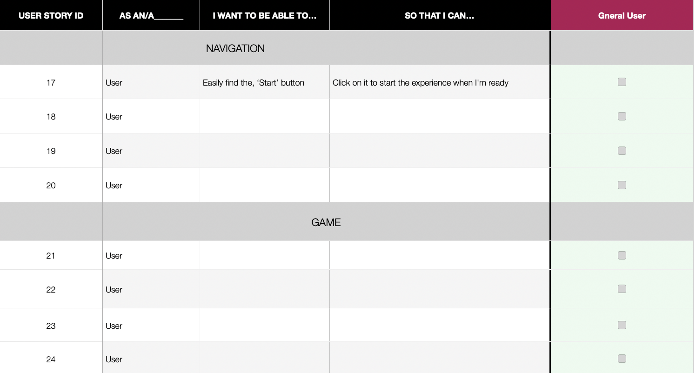

# Spooky Escape

Spooky Escape is an online spooky story experience, that challenges users to make logical decisions that will control their fate. Follow the prompts to escape this terrifying nightmare. This game will be built using HTML, CSS and JavaScript for [Code Institute's](https://codeinstitute.net/) October 2021 [Spookathon](https://hackathon.codeinstitute.net/hackathon/12/).

## UX

 
**Target market**: People that want to have fun while challenging their imagination.

**User Stories**:

User Stories were created during the development phase of this project to help the developers plan out features and create wireframes.

| ID #       | As A/An... | I wan't to be able to... | So that I can... | Status |
| ----------- | ----------- | ----------- | ----------- | ----------- | 
|   1        | User       | Control when the game starts        | Start the game when I'm ready to play   |             |
| 2        | User  |  Use my mouse or keyboard to navigate | Play the game/be part of the experience   |             |
| 3        | User       | Preview a prompt/dialog | Understand how to approach the next level  |             |
| 4        | User       | Choose from a selection of answers | Progress to the next level |             |
| 5        | User       | View my results/status at the end of the game |  Understand how my custom experience ends   |             |

Features:

**- Play:** Starts the game, by having the user click on a button that says, “play” located on the cover/start page (or section of the same page) to start the game.

**- Game:** Allows the user to play the games, by clicking on one of two text-based prompts sent to take them through the interactive game experience.

**“The End”:** Let’s the user know when they have finished their story, by directing them to one of (several) endings.

## Technologies

- [Bootstrap 5](https://getbootstrap.com/docs/5.1/getting-started/introduction/) was used to make this game responsive and visually appealing.

## Credits

- [Code Institute](https://codeinstitute.net/)
- [Hackathon](https://hackathon.codeinstitute.net/)
- [Google Fonts](https://fonts.google.com/)
- [Bootstrap 5](https://getbootstrap.com/docs/5.1/getting-started/introduction/)
- [CSS Tricks](https://css-tricks.com/snippets/css/typewriter-effect/) - The typewriter effect on index.html was learned from this article.